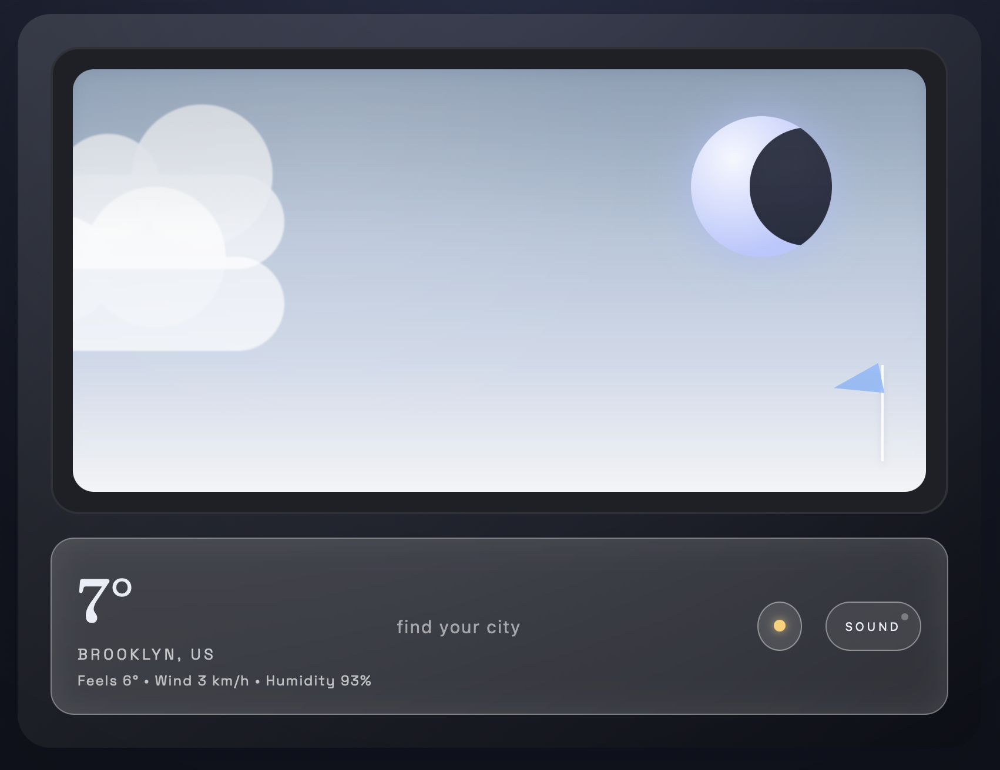

# Window Weather

A lightweight weather website that shows real-time conditions using a public Web API. It maps weather codes to friendly sky states, renders current conditions, and keeps the UI clean and readable.

> "Simple, fast, and focused on the forecast you actually need."

## Screenshot



## Features

- Real-time weather data from a Web API
- Friendly condition mapping (clear, clouds, fog, rain, snow, thunder)
- Minimal UI for quick scanning

## Live Demo

- https://flourish216.github.io/window/

## API Overview

The app requests current weather data from a public API endpoint. The response includes a numeric weather code, temperature, and other condition fields. The code is then mapped to a readable label (e.g., `0` → `clear`, `61` → `rain`) and used to update the UI.

> The API returns structured JSON with current conditions; the app reads the code and translates it to a display-friendly state.

## Example API Request (fetch)

```js
const url = "https://api.example.com/v1/forecast?latitude=40.71&longitude=-74.01&current=temperature_2m,weathercode";

fetch(url)
  .then((res) => {
    if (!res.ok) throw new Error("Request failed");
    return res.json();
  })
  .then((data) => {
    console.log("Current weather:", data.current);
  })
  .catch((err) => {
    console.error(err);
  });
```

## How It Works

1. The app builds a request URL with a location (latitude/longitude).
2. It calls the API and parses the JSON response.
3. The weather code is mapped to a readable label.
4. The UI updates to show current conditions in real time.

## Project Structure

- `index.html` — markup
- `styles.css` — styling
- `script.js` — API calls and rendering logic
